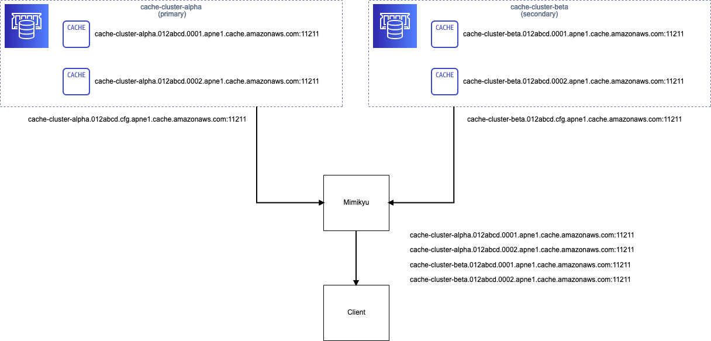

# Mimikyu

Mimikyu is a tiny proxy of ElastiCahce Memceched configuration endpoint designed for safe migration between 2 Memcached clusters.

This implementation is very rough. Please test carefully with your Memcached client before use in production.

## How Mimikyu works

Amazon ElasiCahce Memcached has a mechanism for auto-discovery nodes consists of a Memcached cluster. The configuration endpoint provides the feature.

A Memcached client implemented the auto-discovery protocol fetches all node information (endpoint, port, and so on.) from the endpoint by use `config get cluster` command.

- https://docs.aws.amazon.com/AmazonElastiCache/latest/mem-ug/AutoDiscovery.html
- https://docs.aws.amazon.com/AmazonElastiCache/latest/mem-ug/AutoDiscovery.HowAutoDiscoveryWorks.html

Mimikyu emulates the configuration endpoint. When Mimikyu receives a request from client,

- If the sent command is `stats`
    - Execute same `stats` command to upstream primary cluster. Then, send the response to the client as it as.
    - Respond with secondary stats when primary endpoint is down.
- If the sent command is `config get cluster`
    - Execute `config get cluster` for upstream primary/secondary clusters and collect the responses.
    - Then, put the endpoint information together as a single response for the client.
- If other commands is sent, Mimikyu just returns `SERVER_ERROR` and close the connection from client.
- Also Mimikyu returns error when primary and secondary upstream is down or not exist.

As a result, the client of Mimikyu can discover all nodes included primary cluster and secondary cluster. Hence, we can decrease nodes of primary cluster gradually. 

## Usage

See `mimikyu --help`.

## License

MIT
